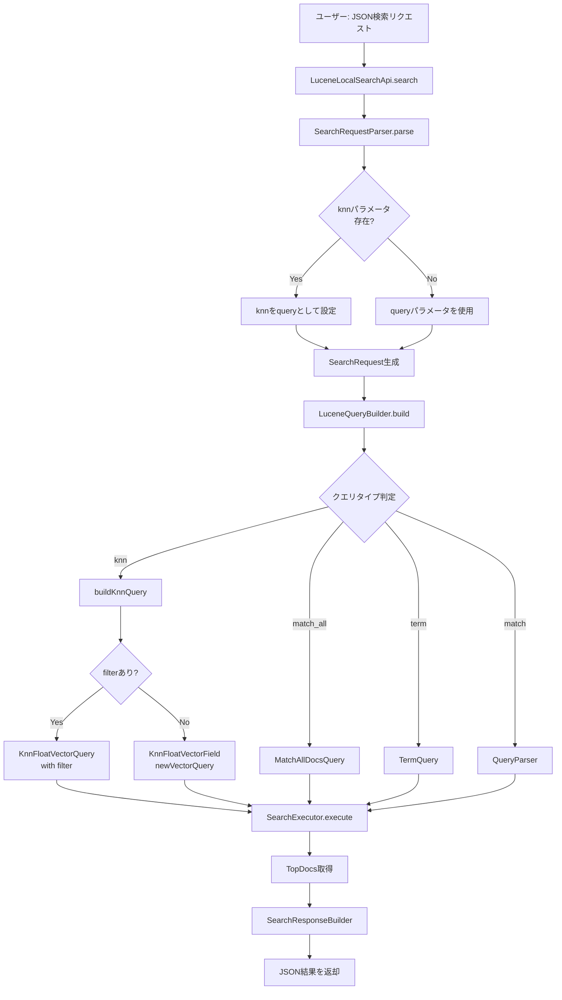
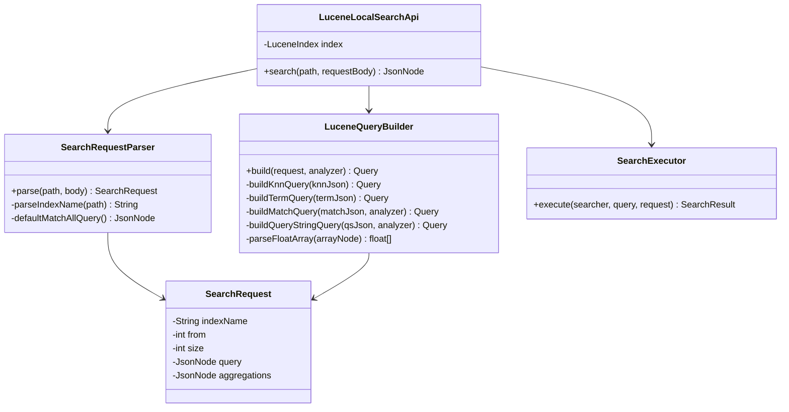
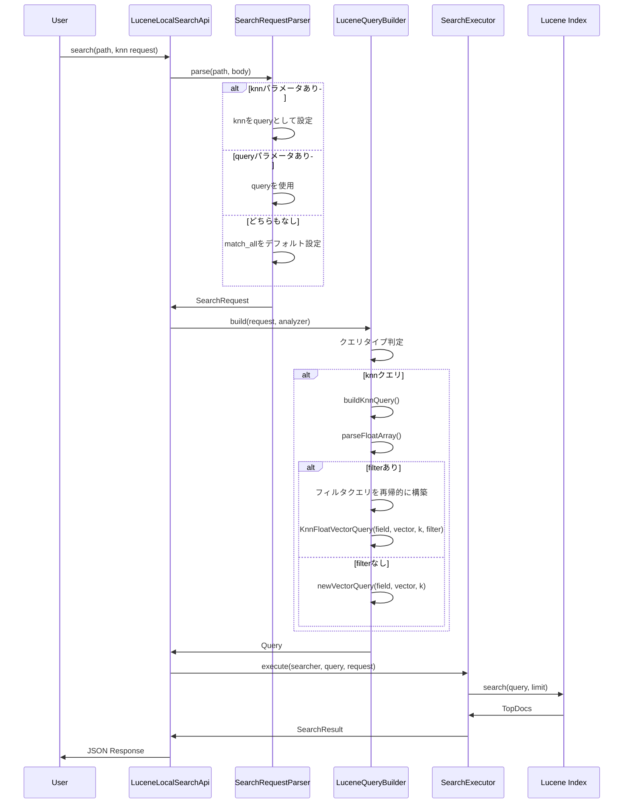

# ベクトル検索アーキテクチャ

## システムフロー



## クラス関係図



## ベクトル検索の処理フロー



## データフロー例

### 入力: ベクトル検索リクエスト

```json
{
  "size": 10,
  "knn": {
    "field": "vector",
    "query_vector": [1.0, 0.0],
    "k": 10,
    "filter": {
      "term": {
        "category": "greeting"
      }
    }
  }
}
```

### 処理ステップ

1. **SearchRequestParser**
   ```
   knnパラメータを検出
   → query = { "knn": { ... } }
   ```

2. **LuceneQueryBuilder**
   ```
   queryJson.has("knn") = true
   → buildKnnQuery()を呼び出し
   
   field = "vector"
   queryVector = [1.0f, 0.0f]
   k = 10
   filter = { "term": { "category": "greeting" } }
   
   → filterQueryを構築: TermQuery("category", "greeting")
   → KnnFloatVectorQuery("vector", [1.0f, 0.0f], 10, filterQuery)
   ```

3. **SearchExecutor**
   ```
   searcher.search(knnQuery, 10)
   → ベクトル類似度でソート
   → フィルタ条件を満たすドキュメントのみ返却
   ```

### 出力: 検索結果

```json
{
  "hits": {
    "total": { "value": 2 },
    "hits": [
      {
        "_id": "1",
        "_score": 0.95,
        "_source": {
          "id": "1",
          "category": "greeting",
          "text_ja": "東京都の人口は多いです。"
        }
      }
    ]
  }
}
```

## 実装のポイント

### 1. フィルタクエリの再帰的構築

`knn.filter`内のクエリは、既存の`LuceneQueryBuilder.build()`を再帰的に呼び出して構築します。

```java
if (knnJson.has("filter")) {
    // filterの中身も通常のクエリとして処理
    Query filterQuery = build(knnJson.get("filter"), analyzer);
    return new KnnFloatVectorQuery(field, queryVector, k, filterQuery);
}
```

### 2. JsonNodeからfloat[]への変換

```java
private static float[] parseFloatArray(JsonNode arrayNode) {
    if (!arrayNode.isArray()) {
        throw new IllegalArgumentException("query_vector must be an array");
    }
    
    int size = arrayNode.size();
    float[] result = new float[size];
    
    for (int i = 0; i < size; i++) {
        result[i] = (float) arrayNode.get(i).asDouble();
    }
    
    return result;
}
```

### 3. 2種類のベクトル検索API

Luceneには2つのベクトル検索方法があります:

```java
// 方法1: フィルタなし（シンプル）
Query query = KnnFloatVectorField.newVectorQuery(field, queryVector, k);

// 方法2: フィルタあり（高度）
Query query = new KnnFloatVectorQuery(field, queryVector, k, filterQuery);
```

## テストシナリオ

### シナリオ1: 基本的なベクトル検索
- ベクトル: [1.0, 0.0]
- 期待結果: ドキュメント1が最上位

### シナリオ2: フィルタ付きベクトル検索
- ベクトル: [1.0, 0.0]
- フィルタ: category = "greeting"
- 期待結果: categoryがgreetingのドキュメントのみ

### シナリオ3: 複雑なフィルタ
- ベクトル: [0.5, 0.5]
- フィルタ: bool query with must + filter
- 期待結果: すべての条件を満たすドキュメント