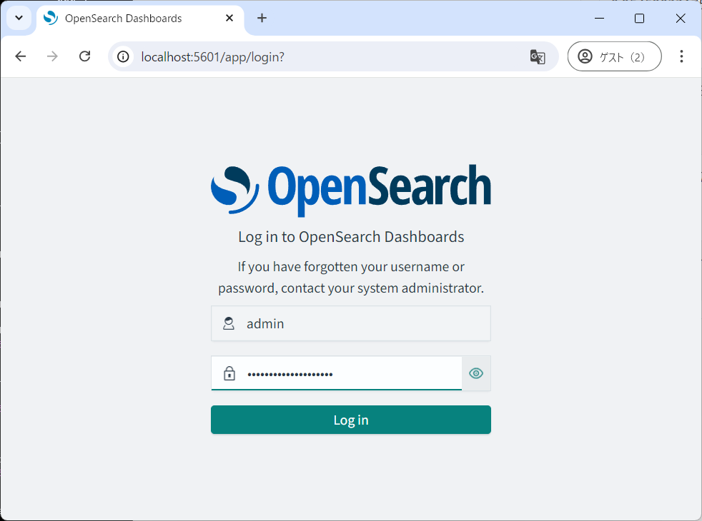

# NLP4J-OpenSearch

# OpenSearch の準備

## 公式ドキュメント 

OpenSearch - Installing OpenSearch - Docker

[https://opensearch.org/docs/latest/install-and-configure/install-opensearch/docker/](https://opensearch.org/docs/latest/install-and-configure/install-opensearch/docker/)


## Docker compose で用意する

docker-compose.yml を用意する

OPENSEARCH_INITIAL_ADMIN_PASSWORD の値に独自のパスワードを指定しておく (user: admin, password: ここで指定したパスワード) でログインすることになる。

```
version: '3'
services:
  opensearch-node1: # This is also the hostname of the container within the Docker network (i.e. https://opensearch-node1/)
    image: opensearchproject/opensearch:latest # Specifying the latest available image - modify if you want a specific version
    container_name: opensearch-node1b
    environment:
      - cluster.name=opensearch-cluster # Name the cluster
      - node.name=opensearch-node1 # Name the node that will run in this container
      - discovery.type=single-node # シングルノードモードを有効化
      - bootstrap.memory_lock=true # Disable JVM heap memory swapping
      - "OPENSEARCH_JAVA_OPTS=-Xms512m -Xmx512m" # Set min and max JVM heap sizes to at least 50% of system RAM
      - OPENSEARCH_INITIAL_ADMIN_PASSWORD=StrongPassword1234##    # Sets the demo admin user password when using demo configuration, required for OpenSearch 2.12 and later
    ulimits:
      memlock:
        soft: -1 # Set memlock to unlimited (no soft or hard limit)
        hard: -1
      nofile:
        soft: 65536 # Maximum number of open files for the opensearch user - set to at least 65536
        hard: 65536
    volumes:
      - opensearch-data1:/usr/share/opensearch/data # Creates volume called opensearch-data1 and mounts it to the container
    ports:
      - 9200:9200 # REST API
      - 9600:9600 # Performance Analyzer
    networks:
      - opensearch-net # All of the containers will join the same Docker bridge network

  opensearch-dashboards:
    image: opensearchproject/opensearch-dashboards:latest # Make sure the version of opensearch-dashboards matches the version of opensearch installed on other nodes
    container_name: opensearch-dashboards2
    ports:
      - 5601:5601 # Map host port 5601 to container port 5601
    expose:
      - "5601" # Expose port 5601 for web access to OpenSearch Dashboards
    environment:
      OPENSEARCH_HOSTS: '["https://opensearch-node1:9200"]' # 単一のノードを指定
    networks:
      - opensearch-net

volumes:
  opensearch-data1:

networks:
  opensearch-net:
```

docker-compose を実行する

```
docker-compose up
```


## 日本語解析用の設定を行う


opensearch-node1b で以下を実行 (opensearch) または docker-composeに追記

```
/usr/share/opensearch/bin/opensearch-plugin install analysis-kuromoji
/usr/share/opensearch/bin/opensearch-plugin install analysis-icu
```

実行結果

```
sh-5.2$ /usr/share/opensearch/bin/opensearch-plugin install analysis-kuromoji
-> Installing analysis-kuromoji
-> Downloading analysis-kuromoji from opensearch
[=================================================] 100%?? 
-> Installed analysis-kuromoji with folder name analysis-kuromoji
sh-5.2$ /usr/share/opensearch/bin/opensearch-plugin install analysis-icu
-> Installing analysis-icu
-> Downloading analysis-icu from opensearch
[=================================================] 100%?? 
-> Installed analysis-icu with folder name analysis-icu
sh-5.2$ 
```

→再起動して反映させる

### 参考

OpenSearchで日本語の検索ができるようにする
[https://zenn.dev/tamanugi/articles/66230d8d685dc5](https://zenn.dev/tamanugi/articles/66230d8d685dc5)

# 管理コンソールを開く

user: admin, password: docker-compose.yml で指定したもの

管理コンソール
[http://localhost:5601/app/home#/](http://localhost:5601/app/home#/)

# SSL設定 (API Callに必要)


## Java 設定

## 方法１: ブラウザで証明書をダウンロードしてキーツールに保存する

JVMを特定する

ブラウザで開いてみて証明書をダウンロードする
[https://localhost:9200/](https://localhost:9200/)

証明書をダウンロードする ( c:\work\localhost_opensearch.crt )

keytool コマンドを実行する

キーストアのデフォルトパスワードは changeit である。

```
C:\Program Files\Java\jdk-17\bin>keytool -import -trustcacerts -file c:\work\localhost_opensearch.crt -keystore "c:\Program Files\Java\jdk-17\lib\security\cacerts"
警告: cacertsキーストアにアクセスするには-cacertsオプションを使用してください
キーストアのパスワードを入力してください:changeit
所有者: CN=node-0.example.com, OU=node, O=node, L=test, C=de
発行者: CN=Example Com Inc. Root CA, OU=Example Com Inc. Root CA, O=Example Com Inc., DC=example, DC=com
シリアル番号: 6984a5113de7ceca2d593ad6b9e54f3e1d74c8b6
有効期間の開始日: Wed Feb 21 02:03:25 GMT+09:00 2024終了日: Sat Feb 18 02:03:25 GMT+09:00 2034
証明書のフィンガプリント:
         SHA1: D6:73:15:72:C5:85:8C:39:21:B0:3F:0F:17:A0:F4:18:C8:D3:9C:D4
         SHA256: 85:71:CE:60:51:97:3C:F8:93:23:32:58:00:1E:AF:81:A0:3C:23:C9:B7:89:4B:0F:F3:32:3F:29:3E:1E:B0:26
署名アルゴリズム名: SHA256withRSA
サブジェクト公開キー・アルゴリズム: 2048ビットRSAキー
バージョン: 3

...

この証明書を信頼しますか。 [いいえ]:  Y
証明書がキーストアに追加されました

C:\Program Files\Java\jdk-17\bin>
```

## 方法2: Javaプログラム中で証明書をインストールできるようにする (略)

# 管理コンソールを開く

user: admin, password: docker-compose.yml で指定したもの

管理コンソール
[http://localhost:5601/app/home#/](http://localhost:5601/app/home#/)



## create index インデックスの作成

```
PUT /myindex1
{
    "settings":{
        "analysis":{
            "analyzer": {
                "default": {
                    "type": "custom",
                    "tokenizer": "kuromoji_tokenizer",
                    "filter": ["kuromoji_part_of_speech"]
                },
                "kuromoji_tokenizer": {
                    "type": "custom",
                    "tokenizer": "kuromoji_tokenizer",
                    "filter": ["kuromoji_part_of_speech"]
                }
            }
        }
    },
    "mappings": {
    "properties": {
      "text_txt_ja": {
        "type": "text",
        "analyzer": "kuromoji_tokenizer"
      },
      "item1_s": {
        "type": "keyword"
      },
      "vector1024": {
        "type": "knn_vector",
        "dimension": 1024
      },
      "vector2": {
        "type": "knn_vector",
        "dimension": 2
      }
    }
   }
}
```

### Response

```
{
  "acknowledged": true,
  "shards_acknowledged": true,
  "index": "myindex1"
}
```

### Tips: kuromoji をインストールした後に再起動をしていないとエラーになる

### インデックス定義の確認

```
GET /myindex1/_mapping
```

```
{
  "myindex1": {
    "mappings": {
      "properties": {
        "item1_s": {
          "type": "keyword"
        },
        "text_txt_ja": {
          "type": "text",
          "analyzer": "kuromoji_tokenizer"
        },
        "vector1024": {
          "type": "knn_vector",
          "dimension": 1024
        },
        "vector2": {
          "type": "knn_vector",
          "dimension": 2
        }
      }
    }
  }
}
```

## 形態素解析

```
GET /myindex1/_analyze
{
  "text": "今日はいい天気です"
}
```

### Response

OK: 単語が正しく切れている

NG: 1文字ごとに切れている

```
{
  "tokens": [
    {
      "token": "今日",
      "start_offset": 0,
      "end_offset": 2,
      "type": "word",
      "position": 0
    },
    {
      "token": "いい",
      "start_offset": 3,
      "end_offset": 5,
      "type": "word",
      "position": 2
    },
    {
      "token": "天気",
      "start_offset": 5,
      "end_offset": 7,
      "type": "word",
      "position": 3
    }
  ]
}
```

## Index document 文書の追加

```
POST /myindex1/_doc/1
{"item1_s":["aaa","bbb","ccc"],"text_txt_ja":"今日はいい天気です","vector2":[1.0,0]}
```

### Response
```
{
  "_index": "myindex1",
  "_id": "1",
  "_version": 1,
  "result": "created",
  "_shards": {
    "total": 2,
    "successful": 1,
    "failed": 0
  },
  "_seq_no": 0,
  "_primary_term": 1
}
```

## Search document 文書の検索 (キーワード検索)

```
GET myindex1/_search
{
  "query" : {
    "term": { "text_txt_ja": "天気" }
  }
}
```

### Response

```
{
  "took": 2,
  "timed_out": false,
  "_shards": {
    "total": 1,
    "successful": 1,
    "skipped": 0,
    "failed": 0
  },
  "hits": {
    "total": {
      "value": 4,
      "relation": "eq"
    },
    "max_score": 0.12776,
    "hits": [
      {
        "_index": "myindex1",
        "_id": "2",
        "_score": 0.12776,
        "_source": {
          "item1_s": [
            "aaa",
            "bbb",
            "ccc"
          ],
          "text_txt_ja": "今日はいい天気です",
          "vector2": [
            1,
            0
          ]
        }
      },
      ...(略)
    ]
  }
}
```

## Search document 文書の検索 (ベクトル検索)

```
GET /myindex1/_search
{
  "query": {
    "script_score": {
      "query": {
        "match_all": {}
      },
      "script": {
        "source": "cosineSimilarity(params.query_vector, doc['vector2']) + 1.0",
        "params": {
          "query_vector": [1.0, 0.0]
        }
      }
    }
  }
}
```

### Response

```
{
  "took": 1, "timed_out": false,
  "_shards": {
    "total": 1,
    "successful": 1,
    "skipped": 0,
    "failed": 0
  },
  "hits": {
    "total": { "value": 4, "relation": "eq" },
    "max_score": 2,
    "hits": [
      {
        "_index": "myindex1",
        "_id": "2",
        "_score": 2,
        "_source": {
          "item1_s": [ "aaa", "bbb", "ccc" ],
          "text_txt_ja": "今日はいい天気です",
          "vector2": [ 1, 0 ]
        }
      },
      {
        "_index": "myindex1",
        "_id": "c-g0dJEBXZv-t_Luic8u",
        "_score": 2,
        "_source": {
          "item1_s": [ "aaa", "bbb", "ccc" ],
          "text_txt_ja": "今日はいい天気です",
          "vector2": [ 1, 0 ]
        }
      },
      {
        "_index": "myindex1",
        "_id": "1",
        "_score": 1.7071068,
        "_source": {
          "item1_s": [ "aaa", "bbb", "ccc" ],
          "text_txt_ja": "今日はいい天気です2024-08-21T01:00:22+09:00",
          "vector2": [ 0.5, 0.5 ]
        }
      },
      ...(略)
    ]
  }
}
```


# Rererence

## docker-compose.yml (1)

```
version: '3'
services:
  opensearch-node1: # This is also the hostname of the container within the Docker network (i.e. https://opensearch-node1/)
    image: opensearchproject/opensearch:latest # Specifying the latest available image - modify if you want a specific version
    container_name: opensearch-node1b
    environment:
      - cluster.name=opensearch-cluster # Name the cluster
      - node.name=opensearch-node1 # Name the node that will run in this container
      - discovery.type=single-node # シングルノードモードを有効化
      - bootstrap.memory_lock=true # Disable JVM heap memory swapping
      - "OPENSEARCH_JAVA_OPTS=-Xms512m -Xmx512m" # Set min and max JVM heap sizes to at least 50% of system RAM
      - OPENSEARCH_INITIAL_ADMIN_PASSWORD=***YOUR_PASSOWRD***    # Sets the demo admin user password when using demo configuration, required for OpenSearch 2.12 and later
    ulimits:
      memlock:
        soft: -1 # Set memlock to unlimited (no soft or hard limit)
        hard: -1
      nofile:
        soft: 65536 # Maximum number of open files for the opensearch user - set to at least 65536
        hard: 65536
    volumes:
      - opensearch-data1:/usr/share/opensearch/data # Creates volume called opensearch-data1 and mounts it to the container
    ports:
      - 9200:9200 # REST API
      - 9600:9600 # Performance Analyzer
    networks:
      - opensearch-net # All of the containers will join the same Docker bridge network

  opensearch-dashboards:
    image: opensearchproject/opensearch-dashboards:latest # Make sure the version of opensearch-dashboards matches the version of opensearch installed on other nodes
    container_name: opensearch-dashboards2
    ports:
      - 5601:5601 # Map host port 5601 to container port 5601
    expose:
      - "5601" # Expose port 5601 for web access to OpenSearch Dashboards
    environment:
      OPENSEARCH_HOSTS: '["https://opensearch-node1:9200"]' # 単一のノードを指定
    networks:
      - opensearch-net

volumes:
  opensearch-data1:

networks:
  opensearch-net:
```

## docker-compose.yml (2)

```
version: '3'
services:
  opensearch-node1: # This is also the hostname of the container within the Docker network (i.e. https://opensearch-node1/)
    image: opensearchproject/opensearch:latest # Specifying the latest available image - modify if you want a specific version
    container_name: opensearch-node1
    environment:
      - cluster.name=opensearch-cluster # Name the cluster
      - node.name=opensearch-node1 # Name the node that will run in this container
      - discovery.seed_hosts=opensearch-node1,opensearch-node2 # Nodes to look for when discovering the cluster
      - cluster.initial_cluster_manager_nodes=opensearch-node1,opensearch-node2 # Nodes eligible to serve as cluster manager
      - bootstrap.memory_lock=true # Disable JVM heap memory swapping
      - "OPENSEARCH_JAVA_OPTS=-Xms512m -Xmx512m" # Set min and max JVM heap sizes to at least 50% of system RAM
      - OPENSEARCH_INITIAL_ADMIN_PASSWORD=***YOUR_PASSOWRD***    # Sets the demo admin user password when using demo configuration, required for OpenSearch 2.12 and later
    ulimits:
      memlock:
        soft: -1 # Set memlock to unlimited (no soft or hard limit)
        hard: -1
      nofile:
        soft: 65536 # Maximum number of open files for the opensearch user - set to at least 65536
        hard: 65536
    volumes:
      - opensearch-data1:/usr/share/opensearch/data # Creates volume called opensearch-data1 and mounts it to the container
    ports:
      - 9200:9200 # REST API
      - 9600:9600 # Performance Analyzer
    networks:
      - opensearch-net # All of the containers will join the same Docker bridge network
  opensearch-node2:
    image: opensearchproject/opensearch:latest # This should be the same image used for opensearch-node1 to avoid issues
    container_name: opensearch-node2
    environment:
      - cluster.name=opensearch-cluster
      - node.name=opensearch-node2
      - discovery.seed_hosts=opensearch-node1,opensearch-node2
      - cluster.initial_cluster_manager_nodes=opensearch-node1,opensearch-node2
      - bootstrap.memory_lock=true
      - "OPENSEARCH_JAVA_OPTS=-Xms512m -Xmx512m"
      - OPENSEARCH_INITIAL_ADMIN_PASSWORD=StrongPassword1234##
    ulimits:
      memlock:
        soft: -1
        hard: -1
      nofile:
        soft: 65536
        hard: 65536
    volumes:
      - opensearch-data2:/usr/share/opensearch/data
    networks:
      - opensearch-net
  opensearch-dashboards:
    image: opensearchproject/opensearch-dashboards:latest # Make sure the version of opensearch-dashboards matches the version of opensearch installed on other nodes
    container_name: opensearch-dashboards
    ports:
      - 5601:5601 # Map host port 5601 to container port 5601
    expose:
      - "5601" # Expose port 5601 for web access to OpenSearch Dashboards
    environment:
      OPENSEARCH_HOSTS: '["https://opensearch-node1:9200","https://opensearch-node2:9200"]' # Define the OpenSearch nodes that OpenSearch Dashboards will query
    networks:
      - opensearch-net

volumes:
  opensearch-data1:
  opensearch-data2:

networks:
  opensearch-net:
```

## Java keytool

```
C:\Program Files\Java\jdk-17\bin>keytool -import -trustcacerts -file c:\work\localhost_opensearch.crt -keystore "c:\Program Files\Java\jdk-17\lib\security\cacerts"
警告: cacertsキーストアにアクセスするには-cacertsオプションを使用してください
キーストアのパスワードを入力してください:changeit
所有者: CN=node-0.example.com, OU=node, O=node, L=test, C=de
発行者: CN=Example Com Inc. Root CA, OU=Example Com Inc. Root CA, O=Example Com Inc., DC=example, DC=com
シリアル番号: 6984a5113de7ceca2d593ad6b9e54f3e1d74c8b6
有効期間の開始日: Wed Feb 21 02:03:25 GMT+09:00 2024終了日: Sat Feb 18 02:03:25 GMT+09:00 2034
証明書のフィンガプリント:
         SHA1: D6:73:15:72:C5:85:8C:39:21:B0:3F:0F:17:A0:F4:18:C8:D3:9C:D4
         SHA256: 85:71:CE:60:51:97:3C:F8:93:23:32:58:00:1E:AF:81:A0:3C:23:C9:B7:89:4B:0F:F3:32:3F:29:3E:1E:B0:26
署名アルゴリズム名: SHA256withRSA
サブジェクト公開キー・アルゴリズム: 2048ビットRSAキー
バージョン: 3

拡張:

#1: ObjectId: 2.5.29.35 Criticality=false
AuthorityKeyIdentifier [
KeyIdentifier [
0000: 17 87 DF A0 5A EB 66 12   A7 D5 D0 F8 BA 12 45 3C  ....Z.f.......E<
0010: B7 2B 00 9C                                        .+..
]
]

#2: ObjectId: 2.5.29.19 Criticality=true
BasicConstraints:[
  CA:false
  PathLen: undefined
]

#3: ObjectId: 2.5.29.37 Criticality=false
ExtendedKeyUsages [
  serverAuth
  clientAuth
]

#4: ObjectId: 2.5.29.15 Criticality=false
KeyUsage [
  DigitalSignature
  Non_repudiation
  Key_Encipherment
]

#5: ObjectId: 2.5.29.17 Criticality=false
SubjectAlternativeName [
  OIDName: 1.2.3.4.5.5
  DNSName: node-0.example.com
  DNSName: localhost
  IPAddress: 0:0:0:0:0:0:0:1
  IPAddress: 127.0.0.1
]

#6: ObjectId: 2.5.29.14 Criticality=false
SubjectKeyIdentifier [
KeyIdentifier [
0000: D3 FA 83 41 A6 35 D2 32   28 C0 28 CB 52 9C FF 1D  ...A.5.2(.(.R...
0010: F4 17 CA DF                                        ....
]
]

この証明書を信頼しますか。 [いいえ]:  Y
証明書がキーストアに追加されました

C:\Program Files\Java\jdk-17\bin>
```

