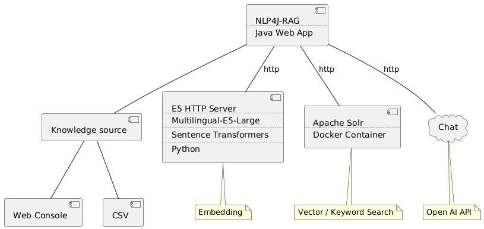

# NLP4J-RAG

# PUML Component Diagram



```
@startuml

component C0[
Knowledge source
]

component C0a[
Web Console
]

component C0b[
CSV
]


component C1[
NLP4J-RAG
....
Java Web App
]


component C2[
E5 HTTP Server
....
Multilingual-E5
....
Python
]

note bottom of C2: Embedding


component C3[
Apache Solr
....
Docker Container
]

note bottom of C3: Vector / Keyword Search

cloud C4[
Chat
]

note bottom of C4: Open AI API


[C1]--C0
[C0]--C0a
[C0]--C0b
[C1]--C2 : http
[C1]--C3 : http
[C1]--C4 : http

@enduml
```

# 準備

## ベクトルDB (Solr) の起動

[nlp4j-solr/README.md](https://github.com/oyahiroki/nlp4j/tree/master/nlp4j/nlp4j-solr) の方法で Solrを用意する

## Multilingual E5 Embedding の起動

[https://github.com/oyahiroki/nlp4j-llm-embeddings-e5](https://github.com/oyahiroki/nlp4j-llm-embeddings-e5) の方法で Multilingual E5 Embedding を起動する

```
python3 nlp4j-embedding-server-e5.py
```

```
$ python3 nlp4j-embedding-server-e5.py
init HttpServer
http://127.0.0.1:8888/?text=これはテストです。
http://127.0.0.1:8888/?text=%E3%81%93%E3%82%8C%E3%81%AF%E3%83%86%E3%82%B9%E3%83%88%E3%81%A7%E3%81%99%E3%80%82
curl -X POST -H "Content-Type: application/json" -d "{\"text\":\"これはテストです。\"}" http://127.0.0.1:8888/
Expected response: {"message": "ok", "time": "2024-05-26T23:21:38", "text": "これはテストです。", "embeddings": [0.04231283441185951, -0.0035561583936214447, -0.014567600563168526, ... 0.022928446531295776]}

```


# 環境変数


## API KEY for Open AI

```
-Dopenai.api_key=xxx
-Dopenai.organization=xxx
```

## URL for Google SpreadSheet

SphreadSheet の共有URLに「/export?format=csv」を追加する

```
-Dgoogle.spreadsheet.knowledge.url=xxx
```


